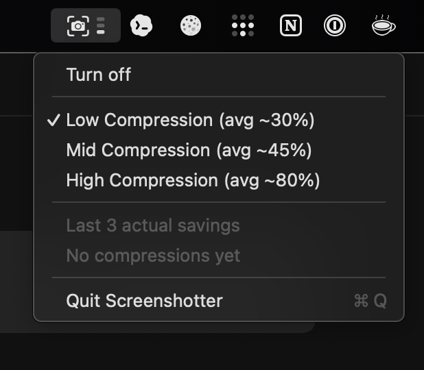

# screenshotter

[](https://www.npmjs.com/package/@marttinn/screenshotter)
[](LICENSE)
[](#install)

Local macOS screenshots for coding agents.

Take a screenshot. `screenshotter` optimizes it locally and copies it to your clipboard.

## Demo


**The menu-bar icon animates while processing and confirms when both files are ready:** a compressed screenshot and a Markdown sidecar containing direct macOS Accessibility text, without OCR. The demo pastes the same bundle into Codex and Claude.

## Install

Requires macOS and Node.js 20+.

[npm package](https://www.npmjs.com/package/@marttinn/screenshotter):

```sh
npm install -g @marttinn/screenshotter
screenshotter doctor
```

Try without installing:

```sh
npx @marttinn/screenshotter doctor
```

Development checkout:

```sh
git clone https://github.com/mgranados/screenshotter.git
cd screenshotter
npm install
npm run check
node bin/screenshotter.mjs doctor
```

When running from source, replace `screenshotter` with `node bin/screenshotter.mjs`, or symlink it:

```sh
mkdir -p ~/.local/bin
ln -sf "$PWD/bin/screenshotter.mjs" ~/.local/bin/screenshotter
```

## Use

```sh
screenshotter watch --verbose
```

Take a screenshot with `Cmd+Shift+3` or `Cmd+Shift+4`, then paste into Codex, Claude, or another agent with `Cmd+V`.

Optional menu bar:

```sh
screenshotter toolbar
```



This is the same watcher with a small menu-bar control. It needs Apple command line tools for the optional menu bar; without them, use `screenshotter watch`.

Screenshot preparation is pipelined: app detection runs while the screenshot finishes writing, then image compression runs alongside direct text extraction. OCR starts only when direct text is unavailable. A repeatable performance test keeps this path at least 20% faster than running those steps one by one; the current local result is about 36% faster.

For pi:

```sh
pi install npm:@marttinn/screenshotter
```

Then run `/screenshotter on`.

## Savings

| Size | Original | Default | Size saved | Bandwidth saved / 1k |
| --- | ---: | ---: | ---: | ---: |
| Pro Display XDR 6016x3384 | 5.48 MB | 0.89 MB | 93% | 5.0 GB |
| 16in MacBook Pro 3456x2234 | 1.86 MB | 0.83 MB | 89% | 1.6 GB |
| 14in MacBook Pro 3024x1964 | 2.34 MB | 0.75 MB | 91% | 2.1 GB |
| Window 1920x1200 | 1.04 MB | 0.40 MB | 81% | 0.8 GB |
| Window 1440x900 | 0.63 MB | 0.38 MB | 68% | 0.4 GB |

Average from 5 recent screenshots. Default preserves readability. Downscale defaults are checked with Apple Vision text-readability benchmarks.

Default mode helps with:

- Upload bandwidth: often `2-5 MB -> ~1-2 MB` with the native default; smaller targets are available with `--optimizer sharp` when Sharp is installed separately.
- Paste/send latency: less image data for Codex or Claude to ingest.
- Local storage: optimized copies are smaller.
- Reliability: less likely to hit attachment limits.
- Readability per byte: efficient encoding while keeping dimensions high.

## Profiles

```sh
screenshotter watch --profile readability  # default
screenshotter watch --profile balanced
screenshotter watch --profile token
```

The menu bar and pi use the same profiles. In pi: `/screenshotter readability`, `/screenshotter balanced`, or `/screenshotter token`. Text is also opt-in: `/screenshotter text` enables direct providers only, while `/screenshotter ocr` explicitly adds OCR fallback.

## Text extraction

Text extraction is opt-in. `--with-text` reads visible text through macOS Accessibility and bundles it with the compressed screenshot.

```sh
screenshotter doctor --prompt-permissions
screenshotter toolbar --with-text --with-target-context --clipboard-mode attachments
```

Grant Accessibility permission once to the terminal or app running `screenshotter`. OCR is not used by default. Enable it explicitly when needed:

```sh
screenshotter prepare-latest --ocr --json                 # OCR only
screenshotter toolbar --with-text --text-provider auto    # Accessibility, then OCR fallback
```

## JavaScript API

The package also exposes a small ESM API for tools that want the same prepared screen objects without shelling out:

```js
import { prepareLatestForClipboard, prepareImage } from "@marttinn/screenshotter";

const prepared = await prepareImage("/path/to/screenshot.png", {
  withText: true,
  withTargetContext: true,
});

await prepareLatestForClipboard({
  withText: true,
  withTargetContext: true,
  clipboardMode: "attachments",
});
```

## Commands

```sh
screenshotter watch --verbose
screenshotter watch --with-text --with-target-context --verbose
screenshotter toolbar
screenshotter clip --with-text --target codex-app
screenshotter claude-app --verbose
screenshotter prepare-latest --target manual --ocr --json
screenshotter claim --target manual --json
screenshotter gc --json
screenshotter bench --latest 20 --tokens --json
screenshotter doctor
```

## Historical savings

Each newly prepared screenshot updates a persistent aggregate at:

```text
~/Library/Application Support/screenshotter/stats.json
```

Check lifetime data saved with:

```sh
screenshotter stats --json
screenshotter status --json
```

Screen records are bounded to 500 by default. Ready records expire after 24 hours and cleared or claimed records after 30 days. `screenshotter gc --json` runs retention immediately and removes orphan optimized files; `SCREENSHOTTER_READY_RETENTION_MS`, `SCREENSHOTTER_RECORD_RETENTION_MS`, and `SCREENSHOTTER_MAX_SCREEN_RECORDS` override those defaults.

MCP, experimental:

```sh
codex mcp add screenshotter -- screenshotter mcp-server
claude mcp add screenshotter -- screenshotter mcp-server
```

For agent/tool discovery, see [docs/agents.md](docs/agents.md).

Verbose runs write JSONL logs to:

```text
~/Library/Application Support/screenshotter/logs/events.jsonl
```

Each event includes stage timings, so slow target detection, text extraction, compression, or clipboard delivery can be identified directly.

## License

MIT.
