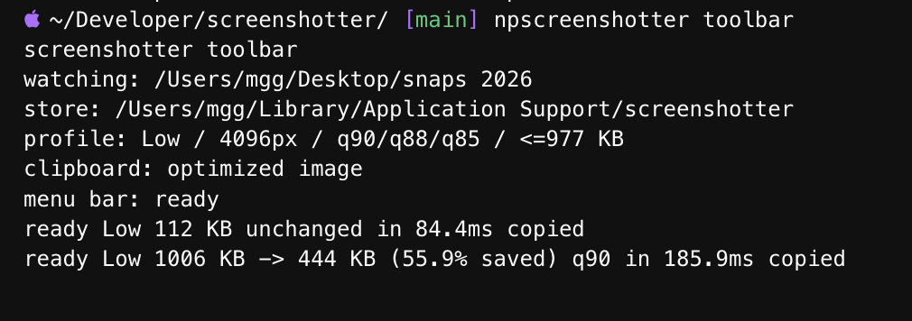

# screenshotter

Local macOS screenshots for coding agents.

Take a screenshot. `screenshotter` optimizes it locally and copies it to your clipboard.

## Preview



## Install

Requires macOS and Node.js 20+.

```sh
git clone https://github.com/mgranados/screenshotter.git
cd screenshotter
npm install
node bin/screenshotter.mjs doctor
```

Optional command:

```sh
mkdir -p ~/.local/bin
ln -sf "$PWD/bin/screenshotter.mjs" ~/.local/bin/screenshotter
```

## Use

```sh
node bin/screenshotter.mjs watch --verbose
```

Take a screenshot with `Cmd+Shift+3` or `Cmd+Shift+4`, then paste into Codex, Claude, or another agent with `Cmd+V`.

The examples below use `screenshotter`. If you skipped the optional command, replace it with `node bin/screenshotter.mjs`.

Optional menu bar:

```sh
screenshotter toolbar
```

This is the same watcher with a small menu-bar control. It needs Apple command line tools for the optional menu bar; without them, use `screenshotter watch`.

For pi:

```sh
pi install . -l
```

Then run `/screenshotter on`.

## Savings

| Size | Original | Default | Size saved | Bandwidth saved / 1k |
| --- | ---: | ---: | ---: | ---: |
| Pro Display XDR 6016x3384 | 5.48 MB | 0.89 MB | 93% | 5.0 GB |
| 16in MacBook Pro 3456x2234 | 1.86 MB | 0.83 MB | 89% | 1.6 GB |
| 14in MacBook Pro 3024x1964 | 2.34 MB | 0.75 MB | 91% | 2.1 GB |
| Window 1920x1200 | 1.04 MB | 0.40 MB | 81% | 0.8 GB |
| Window 1440x900 | 0.63 MB | 0.38 MB | 68% | 0.4 GB |

Average from 5 recent screenshots. Default preserves readability. Downscale defaults are checked with Apple Vision text-readability benchmarks.

Default mode helps with:

- Upload bandwidth: often `2-5 MB -> <1 MB`.
- Paste/send latency: less image data for Codex or Claude to ingest.
- Local storage: optimized copies are smaller.
- Reliability: less likely to hit attachment limits.
- Readability per byte: efficient encoding while keeping dimensions high.

## Profiles

```sh
screenshotter watch --profile readability  # default
screenshotter watch --profile balanced
screenshotter watch --profile token
```

The menu bar and pi use the same profiles. In pi: `/screenshotter readability`, `/screenshotter balanced`, or `/screenshotter token`.

## Commands

```sh
screenshotter watch --verbose
screenshotter toolbar
screenshotter clip --target codex-app
screenshotter claude-app --verbose
screenshotter prepare-latest --target manual --json
screenshotter claim --target manual --json
screenshotter bench --latest 20 --tokens --json
screenshotter doctor
```

MCP, experimental:

```sh
codex mcp add screenshotter -- screenshotter mcp-server
claude mcp add screenshotter -- screenshotter mcp-server
```

For agent/tool discovery, see [docs/agents.md](docs/agents.md).

Verbose runs write JSONL logs to:

```text
~/Library/Application Support/screenshotter/logs/events.jsonl
```

## License

MIT.
